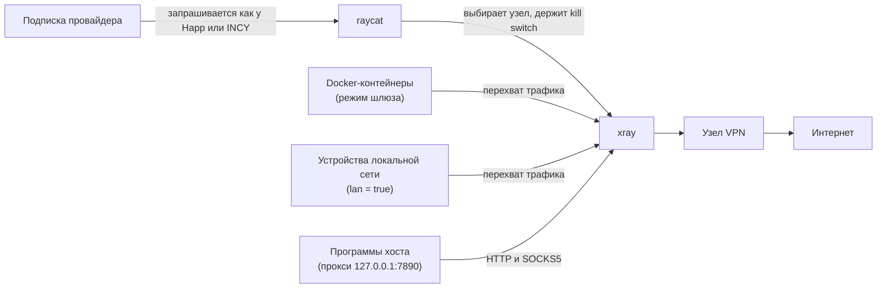

<div align="center">


# raycat

**VPN-подписка для сервера: шлюз и прокси для хоста и Docker-контейнеров**

[](https://github.com/raycat-app/raycat/actions/workflows/ci.yml)
[](https://scorecard.dev/viewer/?uri=github.com/raycat-app/raycat)
[](LICENSE)
[](https://github.com/raycat-app/raycat/releases)

Русский · [English](README.en.md)

</div>

> [!IMPORTANT]
> raycat в разработке: первая версия ещё не выпущена.

## Что это

raycat — клиент VPN-подписок для Linux-серверов. Он получает подписку у провайдера и
выпускает через VPN трафик всего сервера, Docker-контейнеров или устройств домашней
сети, не требуя настроек в каждом приложении. Подписки, которые провайдеры выдают
только приложениям Happ и INCY, тоже работают: raycat запрашивает их так же, как эти
приложения. Туннель строит [xray-core](https://github.com/XTLS/Xray-core) — то же ядро,
что внутри Happ.

## Возможности

- **Приложения в Docker выходят в интернет только через VPN — без настроек внутри них.**
  Контейнер подключается к шлюзу raycat, и весь его трафик идёт через туннель.
- **Весь сервер или отдельные программы.** Трафик хоста можно направить через VPN целиком
  (служба systemd) или только программам, которые ходят через прокси `127.0.0.1:7890`
  (HTTP и SOCKS5).
- **Устройства домашней сети без своего VPN.** Телевизор, телефон или приставка выходят в
  интернет через сервер с raycat.
- **Подписки, которые не открываются обычными клиентами.** raycat получает подписку так же,
  как Happ для Windows и Android или INCY для Android.
- **Резервные подписки и переключение на живой узел.** Приоритеты подписок и узлов, списки
  разрешённых и запрещённых узлов по маскам имён, переключение без лишних скачков между узлами.
- **Kill switch (аварийный выключатель: без туннеля трафик не выходит мимо VPN).** Пока туннель
  не работает, трафик устройств и контейнеров не уходит напрямую, в том числе DNS.
- **Управление без перезапуска.** Команды `raycat status`, `nodes`, `use`, `update` и
  полноэкранный `raycat tui`: закрепить узел, обновить подписки, посмотреть события.
- **Лёгкий и переносимый.** Статические бинарники для x86_64, arm64 и armv7 (Raspberry Pi),
  образ Docker, установка одной командой. Лимит памяти xray настраивается (по умолчанию
  96 МиБ). Для Raspberry Pi 3/4 и других процессоров без аппаратного AES есть вариант
  с тегом `-noaes`.

## Быстрый старт

Перед первым запуском установите raycat: [установка на сервер](#установка-на-сервер).

### Docker: шлюз для контейнеров

```yaml
# compose.yml
services:
  raycat:
    image: ghcr.io/raycat-app/raycat
    restart: unless-stopped
    cap_add: [NET_ADMIN]
    dns: [1.1.1.1]
    volumes:
      - ./config.toml:/etc/raycat/config.toml:ro
      - raycat-state:/var/lib/raycat

  app:
    image: ваше-приложение
    network_mode: service:raycat
    depends_on:
      raycat:
        condition: service_healthy
        restart: true

volumes:
  raycat-state:
```

```toml
# config.toml
[[subscription]]
name = "основная"
url = "https://…"
app = "happ"
platform = "windows"

[mode]
type = "gateway"
```

Усиленная изоляция шлюза и другие варианты описаны в
[разделе про Docker](#шлюз-для-docker-контейнеров).

### Сервер целиком (systemd)

Установщик создаёт `/etc/raycat/config.toml` с примером. Впишите в него ссылку подписки и
режим шлюза, затем запустите службу:

```toml
# /etc/raycat/config.toml
[[subscription]]
name = "основная"
url = "https://…"
app = "happ"
platform = "windows"

[mode]
type = "gateway"
```

```sh
sudo systemctl start raycat
sudo raycat status
```

### Прокси для приложений

В режиме `proxy` (по умолчанию) raycat слушает `127.0.0.1:7890` и принимает HTTP и SOCKS5
без пароля. Настройте подписку, как в примере выше, но без блока `[mode]`, и запустите
службу (`sudo systemctl start raycat`) или `raycat daemon`. Затем направьте программу на прокси:

```sh
curl -x socks5h://127.0.0.1:7890 https://example.com
export HTTPS_PROXY=http://127.0.0.1:7890   # для программ, которые читают переменные окружения
```

## Как это работает



raycat получает подписку, выбирает узел по приоритетам и правилам, следит за ним и переключает
при сбое. xray поднимает туннель и выполняет трафик. В режиме шлюза raycat настраивает
правила nftables и маршрутизации: трафик хоста, контейнеров и устройств перехватывается
прозрачно (TPROXY — перехват ядра Linux, при котором приложения ничего не знают о прокси)
и отправляется в xray. В режиме прокси правил нет: программы сами обращаются к прокси.

## Управление

Команды клиента (`status`, `health`, `nodes`, `use`, `update`, `events`, `tui`) обращаются
к запущенной службе через сокет и файл настроек не читают. Справка: `raycat --help` и
`raycat help <команда>`.

| Команда | Что делает |
| --- | --- |
| `raycat daemon` | Работает в переднем плане: получает подписки и держит xray. Так запускаются служба и контейнер. |
| `raycat check` | Проверяет настройки, собирает конфиг xray из кэша подписок и прогоняет `xray run -test`. Нужен кэш: демон должен получить подписку. |
| `raycat fetch <подписка>` | Разово запрашивает подписку и показывает ответ, сведения провайдера и узлы. Ничего не применяет и не сохраняет. |
| `raycat identity` | Показывает эмулируемое устройство по каждой подписке. HWID выводится полностью: не публикуйте этот вывод. |
| `raycat status [--json]` | Состояние демона: режим, xray, текущий узел, подписки. |
| `raycat health` | Быстрая проверка готовности: демон отвечает, xray работает, узел выбран. Код 0 или 1, для HEALTHCHECK. |
| `raycat nodes [-s подписка] [--all] [--json]` | Таблица узлов. По умолчанию живые и выбранный; `--all` — все. |
| `raycat use <узел>` | Закрепить узел: имя, его часть без учёта регистра или `подписка/имя`. |
| `raycat use auto` | Снять закрепление и вернуть автоматический выбор. |
| `raycat update [подписка]` | Обновить подписки сейчас (все или одну) и показать результат. |
| `raycat events [--json]` | Следить за событиями демона до Ctrl+C. |
| `raycat tui` | Полноэкранный интерфейс (см. ниже). |
| `raycat completions bash\|zsh\|fish` | Скрипт автодополнения для оболочки. |

Параметр `--config ПУТЬ` есть у команд `daemon`, `check`, `fetch` и `identity`. Коды возврата:
0 — успех, 1 — ошибка, 2 — ошибка в аргументах.

### TUI

`raycat tui` показывает состояние в реальном времени: шапку (режим, работа xray, kill switch,
текущий узел и причина выбора), разделы «Подписки», «Узлы» и «Журнал» (последние 200
событий) и строку подсказок внизу. Маркер `▶` стоит у выбранного узла, `★` — у закреплённого
вручную. TUI требует терминал и окно не меньше 44×12. Если демон недоступен, экран покажет
причину и будет переподключаться сам.

<!-- скриншот TUI появится здесь -->

| Клавиша | Действие |
| --- | --- |
| `↑` `↓`, `j` `k` | выбрать узел |
| `PgUp` `PgDn` | страница вверх и вниз |
| `Home` `End`, `g` `G` | в начало и в конец |
| `Enter` | закрепить выбранный узел |
| `a` | вернуть автоматический выбор |
| `u` | обновить все подписки |
| `U` | обновить подписку, выбранную `Tab`; без фильтра по подписке — подписку узла под курсором |
| `/` | фильтр по тексту (`Enter` — применить, `Esc` — сбросить) |
| `Tab`, `Shift+Tab` | фильтр по подписке, по кругу |
| `Esc` | сбросить фильтры (в режиме поиска — только текст) |
| `?` или `F1` | справка; любая клавиша закрывает её |
| `q`, `Ctrl+C` | выйти |

В режиме фильтра буквы, в том числе `q`, попадают в строку поиска.

## Настройки

Файл настроек — TOML. В службе это `/etc/raycat/config.toml`, в Docker — смонтированный файл.
Неизвестный ключ — ошибка, опечатка не пройдёт незамеченной. raycat показывает все ошибки
сразу, с именами полей. Размер файла не больше 1 МиБ.

Длительности пишутся как `500ms`, `30s`, `5m`, `6h`, `1d`, допускаются сочетания (`1h30m`).
Размеры: `B`, `KiB`, `MiB`, `GiB` (`MB` не понимается). В единицах и в словах-значениях
(`happ`, `windows`, `debug`) регистр не важен.

Справочник разложен по секциям. Значения «не задано» означают, что raycat выбирает их сам.

<details>
<summary><code>[device]</code> — что сообщается провайдеру об устройстве</summary>

| Ключ | По умолчанию | Допустимо | Что делает |
| --- | --- | --- | --- |
| `seed` | не задано: демон создаёт машинный идентификатор в каталоге состояния | непустая строка до 256 символов; нельзя вместе с `machine_id` | Слово, по которому провайдер узнаёт одно устройство на любом сервере. Переменная: `RAYCAT_SEED` |
| `machine_id` | не задано | 32 шестнадцатеричных символа | Идентификатор устройства, если он уже известен провайдеру |
| `hostname`, `model`, `manufacturer`, `os_version`, `locale` | не задано: значение выбирает демон | непустая строка до 128 символов, без переводов строк и табуляции | Значения, которые уходят провайдеру в заголовках запроса |

```toml
[device]
seed = "любое-слово-одинаковое-на-всех-серверах"
```

</details>

<details>
<summary><code>[[subscription]]</code> — подписки</summary>

Первая подписка — основная. Остальные — резервные, в порядке объявления.

| Ключ | По умолчанию | Допустимо | Что делает |
| --- | --- | --- | --- |
| `name` | обязательно | 1–64 символа, без `/` и управляющих символов; имена не повторяются | Имя подписки в командах (`raycat fetch`, `raycat update`) и в `selection.pin` |
| `url` | обязательно, если нет `url_file` | `https://…`; `http://` только с `allow_http = true`; до 2048 символов; без логина и пароля в ссылке | Ссылка подписки. Это секрет: в журналах она сокращается. Переменная: `RAYCAT_SUBSCRIPTION` (только первая подписка) |
| `url_file` | не задано | путь к файлу не больше 4 КиБ с одной ссылкой; вместе с `url` не задаётся | Ссылка из файла, например Docker secret. Переменная: `RAYCAT_SUBSCRIPTION_FILE` |
| `allow_http` | `false` | `true`, `false` | Разрешает `http://` для этой подписки. По http ссылка и ответ передаются открыто |
| `app` | обязательно | `happ`, `incy` | Приложение, которое имитирует raycat. Переменная: `RAYCAT_APP` (только первая подписка) |
| `platform` | обязательно | `windows`, `android`; для `incy` только `android` | Платформа имитации. Переменная: `RAYCAT_PLATFORM` (только первая подписка) |
| `seed` | не задано: общий `device.seed` | как у `device.seed` | Собственное устройство для этой подписки |
| `update_interval` | интервал из ответа провайдера; если его нет, `12h` | от `10m` до `30d` | Как часто обновлять подписку |
| `allow` | `[]`: все узлы | до 256 масок | Белый список. Если список не пуст, берутся только узлы, подошедшие хотя бы под одну маску |
| `deny` | `[]` | до 256 масок | Чёрный список: узлы, подошедшие под маску, не используются |
| `priority` | `[]` | до 256 масок | Предпочтительные узлы: чем раньше маска в списке, тем выше приоритет |

Маска сравнивается с именем узла (без названия подписки). `*` означает любое количество
символов, `?` — ровно один. Регистр не важен.

Вместо `url` можно указать файл со ссылкой (Docker secret):

```toml
[[subscription]]
name = "основная"
url_file = "/run/secrets/raycat_sub"
app = "happ"
platform = "windows"
```

</details>

<details>
<summary><code>[selection]</code> — выбор узла</summary>

| Ключ | По умолчанию | Допустимо | Что делает |
| --- | --- | --- | --- |
| `check_url` | `https://www.gstatic.com/generate_204` | ссылка `http://` или `https://` | Адрес, по которому проверяется, отвечает ли узел |
| `check_interval` | `30s` | от `5s` до `10m` | Как часто проверять узлы |
| `failures` | `3` | целое от `1` до `20` | Сколько проверок подряд без ответа делают узел недоступным; тогда выбирается другой |
| `switch_gain` | `150ms` | от `0ms` до `60s` | На сколько узел того же приоритета должен быть быстрее текущего, чтобы переключиться. Нужно два подтверждения подряд |
| `return_delay` | `5m` | от `0ms` до `24h` | Сколько приоритетный узел должен непрерывно работать, прежде чем на него вернуться |
| `pin` | не задано | `«подписка/имя узла»` | Всегда выбирать этот узел, даже когда он не отвечает. Имя узла задаётся точно, как в `raycat nodes --all`. Закрепление из `raycat use` важнее этого ключа |

```toml
[selection]
failures = 3
return_delay = "5m"
```

</details>

<details>
<summary><code>[mode]</code> — режим работы</summary>

| Ключ | По умолчанию | Допустимо | Что делает |
| --- | --- | --- | --- |
| `type` | `proxy` | `proxy`, `gateway` | `proxy` — прокси для программ; `gateway` — шлюз для трафика хоста, контейнеров и устройств. Переменная: `RAYCAT_MODE` |
| `listen` | `127.0.0.1:7890` | `адрес:порт` (IPv4 или `[IPv6]:порт`), порт не 0 | Адрес прокси. Действует только в `proxy`. Переменная: `RAYCAT_LISTEN` |
| `kill_switch` | `true` | `true`, `false` | В режиме `gateway` не пускает трафик мимо туннеля. В `proxy` не действует. Переменная: `RAYCAT_KILL_SWITCH` |
| `lan` | `false` | `true`, `false` | Шлюз для устройств локальной сети. Только в `gateway`. Переменная: `RAYCAT_LAN` |
| `lan_interface` | интерфейс маршрута по умолчанию | до 15 знаков: латинские буквы, цифры, `-`, `_`, `.` | Интерфейс, с которого приходят пакеты устройств. Учитывается при `lan = true` |
| `lan_subnets` | подсети этого интерфейса | от 1 до 32 IPv4-подсетей с префиксом от `/8` до `/31` | Подсети устройств. Учитываются при `lan = true` |

Ключи, которые заданы, но к выбранному режиму не относятся, не применяются. `raycat check`
выводит предупреждение о каждом таком ключе.

```toml
[mode]
type = "gateway"
kill_switch = true
```

</details>

<details>
<summary><code>[dns]</code> — DNS для xray</summary>

| Ключ | По умолчанию | Допустимо | Что делает |
| --- | --- | --- | --- |
| `resolvers` | `["1.1.1.1", "8.8.8.8"]` | от 1 до 8 IP-адресов | DNS-серверы, которыми пользуется xray. Не путайте с ключом `dns:` в Docker Compose |

```toml
[dns]
resolvers = ["1.1.1.1", "9.9.9.9"]
```

</details>

<details>
<summary><code>[routing]</code> — маршрутизация провайдера</summary>

| Ключ | По умолчанию | Допустимо | Что делает |
| --- | --- | --- | --- |
| `provider` | `false` | `true`, `false` | Применять маршрутизацию, которую присылает провайдер в ответе подписки. По умолчанию выключено |

```toml
[routing]
provider = true
```

</details>

<details>
<summary><code>[xray]</code> — ядро и его ресурсы</summary>

| Ключ | По умолчанию | Допустимо | Что делает |
| --- | --- | --- | --- |
| `path` | `/usr/libexec/raycat/xray` | путь до 4096 байт без управляющих символов | Где лежит исполняемый файл xray |
| `memory_limit` | `96MiB` | от `16MiB` до `16GiB` | Мягкий лимит памяти xray |
| `tcp_congestion` | `auto` | `auto`, `off` или имя алгоритма ядра (`bbr`, `cubic`): строчные латинские буквы, цифры, `-`, `_`, до 15 знаков | Алгоритм управления перегрузкой TCP к узлам. `auto` включает BBR, только если хост это позволяет |
| `xhttp_connections` | не задано: как у провайдера | целое от `1` до `16` | Число параллельных соединений XHTTP |

```toml
[xray]
memory_limit = "128MiB"
xhttp_connections = 4
```

</details>

<details>
<summary><code>[log]</code> — журнал</summary>

| Ключ | По умолчанию | Допустимо | Что делает |
| --- | --- | --- | --- |
| `level` | `info` | `error`, `warn`, `info`, `debug` | Подробность журнала. Переменная: `RAYCAT_LOG` |

```toml
[log]
level = "debug"
```

</details>

### Переменные окружения

Переменные перекрывают файл настроек для тех ключей, к которым относятся. Пустое значение
считается незаданным. Переменные `RAYCAT_INSTALL_*` нужны только тестам установщика.

| Переменная | Что задаёт |
| --- | --- |
| `RAYCAT_CONFIG` | Путь к файлу настроек, если не указан `--config`. Если файла нет, это ошибка. По умолчанию `/etc/raycat/config.toml`, если он существует |
| `RAYCAT_SUBSCRIPTION` | `url` первой подписки. Если подписок в файле нет, создаётся подписка `основная`. Нельзя вместе с `RAYCAT_SUBSCRIPTION_FILE` |
| `RAYCAT_SUBSCRIPTION_FILE` | Путь к файлу со ссылкой первой подписки (до 4 КиБ) |
| `RAYCAT_APP`, `RAYCAT_PLATFORM` | Приложение и платформа первой подписки |
| `RAYCAT_SEED` | `device.seed`. Нельзя вместе с `device.machine_id` из файла |
| `RAYCAT_MODE`, `RAYCAT_LISTEN`, `RAYCAT_KILL_SWITCH`, `RAYCAT_LAN`, `RAYCAT_LOG` | Соответствующие ключи `[mode]` и `[log]` |
| `RAYCAT_STATE_DIR` | Каталог состояния: машинный идентификатор, кэш подписок, закрепление. Для root по умолчанию `/var/lib/raycat`; для остальных `$XDG_STATE_HOME/raycat` или `~/.local/state/raycat` |
| `RAYCAT_SOCKET` | Путь сокета API. Для root по умолчанию `/run/raycat/raycat.sock`; для остальных `$XDG_RUNTIME_DIR/raycat.sock`, иначе файл в каталоге состояния |

### Рецепты

**Несколько подписок с приоритетом.** Основная подписка используется, пока в ней есть живой
узел. Резервная выбирается, когда живых узлов в основной нет. Вернуться на основную raycat
решит через `return_delay`.

```toml
[[subscription]]
name = "основная"
url = "https://…"
app = "happ"
platform = "windows"

[[subscription]]
name = "резервная"
url = "https://…"
app = "happ"
platform = "android"
```

**Выбрать страну.** `priority` задаёт порядок предпочтения, `deny` убирает служебные узлы.
Чтобы оставить только одну страну, используйте `allow`.

```toml
[[subscription]]
name = "основная"
url = "https://…"
app = "happ"
platform = "windows"
priority = ["*Германия*", "*Финляндия*"]
deny = ["*Info*"]
```

**Закрепить узел.** Проще командой `sudo raycat use "основная/Германия 1"`; снять закрепление —
`sudo raycat use auto`. Закрепление, сделанное командой, сохраняется при перезапуске и важнее
`pin` из файла. `use auto` отключает и его. Закреплённый узел выбирается, даже если он не
отвечает, поэтому следите за статусом в `raycat status`.

```toml
[selection]
pin = "основная/🇩🇪 Германия 1"
```

**Одно устройство для провайдера на нескольких серверах.** Задайте одно и то же слово в
`device.seed` на каждом сервере. Провайдер увидит одно устройство, а не несколько.

```toml
[device]
seed = "одно-слово-на-всех-серверах"
```

## Установка на сервер

> [!NOTE]
> Первая версия ещё не выпущена: установщик заработает, когда появятся выпуски.
> Пока в проекте нет ни одного stable-выпуска, `--channel dev` ставит последнюю dev-сборку.

Нужны root, `curl` или `wget`, `tar` и `sha256sum`. Одна команда:

```sh
curl -fsSL https://raw.githubusercontent.com/raycat-app/raycat/main/deploy/install.sh | sudo sh
```

Можно сначала скачать скрипт и посмотреть, что он делает:

```sh
curl -fsSLO https://raw.githubusercontent.com/raycat-app/raycat/main/deploy/install.sh
less install.sh
sudo sh install.sh --dry-run   # план без изменений
sudo sh install.sh
```

Установщик выбирает сборку под процессор (x86_64, aarch64, armv7; на процессорах
без AES вроде Raspberry Pi 3/4 берёт ядро xray `-noaes`), проверяет контрольную
сумму по `SHA256SUMS` и при любом несовпадении ничего не меняет. Если установлен и
авторизован `gh`, он дополнительно проверяет происхождение архива
(`gh attestation verify`). Затем он раскладывает файлы:

| Что | Где |
| --- | --- |
| программа | `/usr/local/bin/raycat` |
| ядро xray | `/usr/libexec/raycat/xray` |
| настройки | `/etc/raycat/config.toml` (0600, существующий файл не трогается) |
| состояние | `/var/lib/raycat` |
| служба | `/etc/systemd/system/raycat.service` |
| автодополнение, man, лицензия | `/usr/local/share/…` |

Сетевые настройки хоста установщик не меняет: режим шлюза настраивает сам демон по
файлу настроек. Если systemd есть, служба включается в автозапуск. При первой
установке она ещё не запускается: впишите ссылку подписки в
`/etc/raycat/config.toml` (пример с пояснениями создаётся сам) и выполните
`sudo systemctl start raycat`. Дальше работают `sudo raycat status`, `nodes`, `tui` и
`journalctl -u raycat -f`. Без systemd установщик подскажет команду для ручного
запуска (`raycat daemon`).

- **Канал dev** (последняя сборка из `main`, для опытных): добавьте параметры после
  `sh -s --`: `curl -fsSL … | sudo sh -s -- --channel dev`. Конкретная версия:
  `--version 1.2.3`.
- **Процессор без AES**: `--noaes` принудительно ставит сборку xray `-noaes`, `--no-noaes`
  принудительно её не ставит. Без параметров выбор делается по `/proc/cpuinfo`.
- **Обновление**: повторите установку. Настройки сохраняются, служба
  перезапускается, только если файлы изменились.
- **Удаление**: `sudo sh install.sh --uninstall`. Настройки и состояние остаются;
  `--uninstall --purge` удаляет и их (устройство для провайдера при новой установке
  создастся заново).
- **Все параметры**: `sh install.sh --help`.

## Шлюз для Docker-контейнеров

Приложения живут в сетевом пространстве контейнера raycat (`network_mode:
service:raycat`) и выходят в интернет только через туннель. Рекомендуемые настройки,
с жёсткой изоляцией самого шлюза:

```yaml
# compose.yml
services:
  raycat:
    image: ghcr.io/raycat-app/raycat
    restart: unless-stopped
    read_only: true
    cap_drop: [ALL]
    cap_add: [NET_ADMIN]
    security_opt: ["no-new-privileges:true"]
    tmpfs: [/tmp]
    dns: [1.1.1.1]
    volumes:
      - ./config.toml:/etc/raycat/config.toml:ro
      - raycat-state:/var/lib/raycat

  app:
    image: ваше-приложение
    network_mode: service:raycat
    depends_on:
      raycat:
        condition: service_healthy
        restart: true

volumes:
  raycat-state:
```

```toml
# config.toml
[[subscription]]
name = "основная"
url = "https://…"
app = "happ"
platform = "windows"

[mode]
type = "gateway"
```

- **Права файла настроек.** При `cap_drop: [ALL]` root в контейнере не обходит права
  доступа, поэтому файл с правами 600 другого пользователя хоста не читается. Сделайте
  его читаемым: `chmod 644 config.toml` (каталог закройте от посторонних) или передайте
  root: `sudo chown 0:0 config.toml`, права 600.
- **Состояние и сокет API** лежат в томе `/var/lib/raycat`: корень контейнера остаётся
  только для чтения. Команды работают внутри контейнера:
  `docker compose exec raycat raycat status`.
- **`dns`** нужен: Docker опрашивает свой резолвер из пространства контейнера, где
  запросы перехватываются; без явного адреса шлюз откажется стартовать (иначе имена
  разрешались бы мимо туннеля). Это ключ Docker Compose, а не `[dns]` в `config.toml`.
- **Готовность.** Образ сам проверяет `raycat health` каждые 10 с: демон отвечает, xray
  работает, узел выбран; на первый старт даётся 60 с (панель может отвечать медленно).
  С `condition: service_healthy` приложения не стартуют, пока VPN не готов, а
  `restart: true` перезапускает их вместе со шлюзом. Проверить вручную:
  `docker compose exec raycat raycat health` (код 0 или 1 и причина).

**Ссылка подписки как секрет Docker.** Вместо `url` укажите `url_file = "/run/secrets/raycat_sub"`
и передайте файл через `secrets:` (пробелы и перевод строки по краям не важны; права файла
такие же, как у `config.toml`):

```yaml
services:
  raycat:
    secrets: [raycat_sub]     # к сервису raycat, остальное без изменений
secrets:
  raycat_sub:
    file: ./raycat_sub.txt    # файл с одной строкой: ссылкой подписки
```

## Шлюз для локальной сети

raycat может быть шлюзом для устройств сети: телевизоров, телефонов, консолей,
у которых нет своего VPN. Устройства ходят в интернет через хост с raycat, а он
перехватывает их TCP и UDP и отправляет в туннель.

**Запуск.** raycat должен работать в сетевом пространстве самого хоста: службой
systemd или в Docker с `network_mode: host`. Нужна привилегия `CAP_NET_ADMIN`
(служба от root или `cap_add: [NET_ADMIN]`).

```toml
# /etc/raycat/config.toml
[mode]
type = "gateway"
lan = true
# lan_interface = "eth0"                # по умолчанию: интерфейс маршрута по умолчанию
# lan_subnets = ["192.168.1.0/24"]      # по умолчанию: подсети этого интерфейса
```

```yaml
# compose.yml
services:
  raycat:
    image: ghcr.io/raycat-app/raycat
    network_mode: host
    cap_add: [NET_ADMIN]
    restart: unless-stopped
    environment:
      RAYCAT_SUBSCRIPTION: https://…
      RAYCAT_APP: happ
      RAYCAT_PLATFORM: windows
      RAYCAT_MODE: gateway
      RAYCAT_LAN: "true"
```

`raycat check` покажет, какие интерфейс и подсети будут перехватываться.

**Устройства.** Адрес хоста указывается шлюзом и DNS-сервером: на самом
устройстве или в DHCP роутера, который раздаёт адреса. DNS устройств (любой
сервер, порт 53) тоже идёт через raycat, поэтому имена получают адреса-заглушки
(fake-IP — адреса-заглушки для доменных имён: соединение идёт через туннель по имени),
как и у самого хоста. IPv6 устройств блокируется: отключите его на
устройстве или в роутере, иначе устройство пойдёт мимо хоста.

**Хосту ничего больше не нужно.** Пересылку (`ip_forward`) включать не надо:
перехваченные пакеты доставляются локально, raycat не меняет sysctl. Если пересылка
на хосте включена по другим причинам, kill switch всё равно не выпустит устройства
наружу мимо туннеля.

**Хост остаётся доступным.** Входящие соединения к хосту (SSH и другие службы) и
ответы на них правила не трогают ни при запуске, ни при падении xray, ни при
остановке. Не перехватываются также адреса самого хоста, приватные сети (в том числе
сеть Docker и другие устройства сети), multicast и broadcast. При штатной остановке
raycat снимает свои правила; после аварии они остаются, чтобы держать kill switch,
а следующий запуск ставит их заново.

## Производительность

Всё необязательно и задаётся в разделе `[xray]` файла настроек:

```toml
[xray]
memory_limit = "96MiB"      # по умолчанию
tcp_congestion = "auto"     # auto (по умолчанию), off или имя алгоритма
xhttp_connections = 4       # от 1 до 16; не задано — как у провайдера
```

- `memory_limit` — мягкий лимит памяти xray. Слишком малый заставляет сборщик мусора
  Go работать постоянно и грузит процессор под нагрузкой.
- `tcp_congestion` — управление перегрузкой TCP для соединений к узлам. `auto`
  включает BBR, только если хост это точно позволяет (алгоритм загружен в ядро и
  разрешён процессам или у xray есть `CAP_NET_ADMIN`), иначе пишет в лог, почему
  не включил. BBR ускоряет передачу на каналах с потерями. QUIC-узлы (Hysteria2,
  XHTTP поверх h3) этой настройки не касается: Hysteria2 по умолчанию уже работает
  на BBR.
- `xhttp_connections` — число параллельных соединений XHTTP. Помогает, когда
  провайдер ограничивает скорость одного соединения; цена — больше нагрузка на
  процессор и больше соединений к серверу. Без значения действуют настройки
  провайдера (если их нет, xray берёт 3 соединения). Узлы, где провайдер сам задал
  `xmux`, не меняются.
- Для узлов на QUIC и UDP (Hysteria2, XHTTP поверх h3, mKCP) демон один раз за запуск
  предупреждает, если буферы UDP хоста меньше 7.5 МиБ: тогда стоит поднять
  `net.core.rmem_max` и `net.core.wmem_max` на хосте.
- Процессоры без аппаратного AES (Raspberry Pi 3/4 и другие: в `/proc/cpuinfo` нет флага
  `aes`) получают xray, собранный для быстрого AES-GCM. Установщик выбирает его сам, см.
  `--noaes` в [установке](#установка-на-сервер).

## Частые вопросы и решение проблем

1. **Провайдер не отдаёт узлы, либо все узлы оказались заглушками.** Запустите
   `raycat fetch основная` (имя вашей подписки): команда покажет ответ, срок и остаток трафика.
   - `HTTP 403` («панель блокирует этот клиент или требует HWID») и `HTTP 404` («подписка не
     найдена, либо панель требует HWID») — провайдер не принимает эмуляцию. Проверьте `app` и
     `platform`: провайдер может выдавать узлы только тому приложению, которое вы имитируете.
   - «достигнут лимит устройств» — у провайдера заняты все места. Освободите место в панели или
     используйте уже известный провайдеру `seed` устройства.
   - «все узлы — заглушки (адрес 0.0.0.0 или локальный)» — провайдер вернул только узлы-сообщения.
     Проверьте срок подписки и остаток трафика в панели.

2. **«демон не запущен» или `raycat status` не видит демон.** Проверьте службу:
   `sudo systemctl status raycat` и `journalctl -u raycat -n 100`. После первой установки
   служба сама не запускается: впишите ссылку подписки и выполните `sudo systemctl start raycat`.
   После правки настроек запускайте `sudo systemctl restart raycat`.
   В контейнере журнал смотрите командой `docker compose logs -f raycat`.

3. **«нет прав на сокет … (попробуйте sudo)».** Клиентские команды может выполнять только
   пользователь демона и root. Запускайте их так: `sudo raycat status`. В контейнере:
   `docker compose exec raycat raycat status`.

4. **В Docker шлюз не читает `config.toml` (`Permission denied`).** Это следствие
   `cap_drop: [ALL]`: root контейнера не обходит права файла. Сделайте файл читаемым
   (`chmod 644`) или передайте его root (`chown 0:0`, права 600). Подробности — в
   [разделе про Docker](#шлюз-для-docker-контейнеров).

5. **Шлюз в Docker не стартует.** Прочитайте сообщение:
   - «режиму шлюза нужна привилегия CAP_NET_ADMIN» — добавьте `cap_add: [NET_ADMIN]`.
   - «Docker разрешает имена для этого контейнера через резолвер хоста» — добавьте к сервису
     `dns: [1.1.1.1]` (любой внешний DNS).

6. **Приложения в Docker стартуют без VPN или остаются без сети.** Приложения должны ждать
   `condition: service_healthy`, как в примере. Первый старт шлюза может занять до минуты: образ
   ждёт 60 с, пока подписка даст рабочий узел. Известное ограничение: если шлюз перезапустили
   командой `docker restart`, а не `docker compose restart`, приложения могут остаться без сети.
   Тогда перезапустите их вручную.

7. **Медленно работает на Raspberry Pi 3/4.** Такие процессоры без аппаратного AES. Установщик
   выбирает сборку `-noaes` сам; вручную — `--noaes` при установке или образы `:latest-noaes`
   (только arm64). См. [производительность](#производительность).

8. **Устройство у провайдера сменилось после переустановки.** Машинный идентификатор хранится в
   `/var/lib/raycat/machine-id`. `--uninstall --purge` удаляет его, и при новой установке
   появляется новое устройство. Чтобы сохранить его, задайте `[device] seed` одним и тем же словом
   или не удаляйте каталог состояния. Обычное `--uninstall` его оставляет.

9. **«http небезопасен: используйте https или добавьте allow_http = true».** Подписка по
   `http://` не принимается без `allow_http = true` в её блоке. Лучше получить ссылку по https.
   Если провайдер отдаёт только http, включите `allow_http`: ссылка и ответ пойдут открытым текстом.

10. **«узел не выбран: подписки ещё не дали рабочих узлов».** `raycat nodes --all` покажет все узлы
    и их статус. Если маски `allow` или `deny` отсеяли всё, ослабьте их. Если выбран закреплённый
    узел, который не отвечает, снимите закрепление: `sudo raycat use auto`.

## Безопасность

- **Kill switch.** В режиме `gateway` с `kill_switch = true` (по умолчанию) трафик устройств,
  контейнеров и хоста, который туннель не перехватил, не выходит наружу: ни напрямую, ни через
  DNS, ни по IPv6 и ICMP. Если xray упал, перехваченный трафик получает отказ, а не уходит мимо VPN.
- **Режим proxy защитой не является.** Kill switch там не действует: программы, которые не
  используют прокси, ходят напрямую.
- **Секреты.** Ссылка подписки и `seed` хранятся в `config.toml`; установщик создаёт файл с
  правами 0600. В журналах и сообщениях об ошибках ссылка сокращается до хоста и последних четырёх
  символов пути. Каталог состояния `/var/lib/raycat` доступен только владельцу (0700).
- **Идентификатор устройства.** `raycat identity` печатает HWID полностью, `raycat fetch` его
  скрывает. Не публикуйте вывод `identity` в открытых местах.
- **Прокси без пароля.** Адрес по умолчанию `127.0.0.1` доступен только с этого сервера. Если
  поменять адрес на внешний, любой, кто до него дотянется, сможет выходить через ваш VPN.
- Сообщения об уязвимостях отправляйте приватно: [SECURITY.md](SECURITY.md).

## Версии и каналы

Выпуск автоматический, у каждого канала свои теги.

| Канал | Что это | Образ Docker | Файлы |
| --- | --- | --- | --- |
| **stable** | Рабочие версии `vX.Y.Z`. Прошли канал dev и выдержали срок: изменения профилей эмуляции — сутки, остальные — трое суток. Несовместимые изменения выходят только вручную | `ghcr.io/raycat-app/raycat:latest`, `:X.Y.Z`, `:X.Y` | [Releases](https://github.com/raycat-app/raycat/releases/latest) |
| **dev** | Сборка каждого слияния в `main` после зелёного CI, `vX.Y.Z-dev.N`. Для проверки заранее, не для рабочих серверов; хранятся последние 20 | `:dev`, `:X.Y.Z-dev.N` | pre-release на странице Releases |

Образы многоархитектурные (amd64 и arm64). Для **Raspberry Pi 3/4 и других процессоров
без аппаратного AES** (в `/proc/cpuinfo` нет флага `aes`) есть варианты с xray, собранным
для быстрого AES-GCM на таком железе: образы `:latest-noaes`, `:X.Y.Z-noaes`, `:dev-noaes`
(только arm64) и архивы с `-noaes` в имени (aarch64 и armv7).

Если на открытом issue висит метка `стоп-релиз`, продвижение из dev в stable останавливается.

### Проверка подлинности

Архивы и образы подписаны аттестациями происхождения сборки (GitHub), образы ещё и SBOM.
Проверка нужна [GitHub CLI](https://cli.github.com/):

```sh
sha256sum -c SHA256SUMS
gh attestation verify raycat-X.Y.Z-x86_64-linux-musl.tar.gz --repo raycat-app/raycat
gh attestation verify oci://ghcr.io/raycat-app/raycat:latest --repo raycat-app/raycat
```

## Участие

Предложения и исправления приветствуются: см. [CONTRIBUTING.md](CONTRIBUTING.md).
Об уязвимостях сообщайте приватно: [SECURITY.md](SECURITY.md).

## Лицензия

[MIT](LICENSE).
